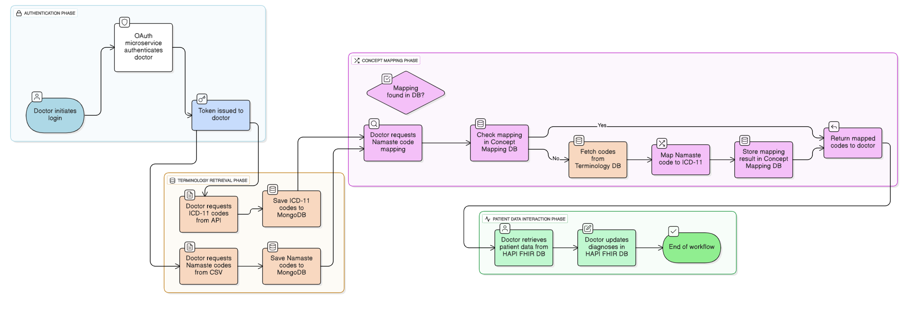

# DualMed: Electronic Medical Record System 

A modern EMR platform for Indian healthcare, enabling **dual/triple coding** using NAMASTE (AYUSH), TM2, and ICD-11 standards. Designed for Smart India Hackathon 2025, DualMed delivers analytics, compliance, and seamless integration of traditional and biomedicine records.

---
## Project Overview

DualMed bridges the gap between traditional Indian medicine and modern healthcare by supporting **dual coding** for diagnoses and treatments.  
- **Traditional Systems Supported:** Ayurveda, Unani, Siddha, Yoga (NAMASTE codes)
- **Modern Systems Supported:** ICD-11 Biomedicine, TM2
- **Interoperability:** Enables hospitals to report and analyze patient data using both Indian and international standards.
- **Analytics & Reporting:** Designed for government compliance, research, and hospital audits.
- **Smart India Hackathon Focus:** Solves the challenge of integrating AYUSH with mainstream EMRs.

---
## 🚀 Features Overview

| Feature                   | Description                                                                    |
|---------------------------|--------------------------------------------------------------------------------|
| Dual/Triple Coding        | Map diagnoses to NAMASTE, TM2, and ICD-11 codes for interoperability           |
| Terminology Search        | Fast auto-complete for NAMASTE, ICD-11, TM2 codes                              |
| Medical Coding Mapping    | Visual mapping engine for dual-coded entries                                   |
| Analytics Dashboard       | Track code usage, compliance rates, mapping accuracy, and trends               |
| Patient/Doctor Dashboards | Unified access to AYUSH and biomedicine records                                |
| Consent & Audit Trails    | Embedded metadata for EHR standards and privacy                                |
| Government Report Export  | One-click export of SIH/Ministry compliance reports                            |
| Responsive UI             | Sidebar navigation, real-time notifications, profile/settings                  |

---
## 🛠 Tech Stack

| Layer       | Technologies Used                        |
|-------------|------------------------------------------|
| Frontend    | ReactJS, Material UI, Chart.js           |
| Backend     | Node.js, Hapi.js (skeleton), Express.js  |
| Database    | MongoDB, FHIRBase                        |
| FHIR Engine | HAPI FHIR (Java)                         |
| APIs        | WHO ICD-11, NAMASTE CSV, TM2 Dataset     |
| Security    | OAuth2.0, JWT, DPDP Act compliance       |
| Deployment  | Docker, AWS, Vercel                      |

---
## Setup Instructions

1. **Clone the repo**
   ```
   git clone https://github.com/Dwij45/Electronic-Medical-Record.git
   cd Electronic-Medical-Record
   ```
2. **Install dependencies**
   ```
   npm install
   ```
3. **Start the frontend**
   ```
   npm start
   ```
4. **Backend setup**
   - Backend is currently a skeleton. Add Node.js/Hapi.js/Express.js services for FHIR endpoints and terminology APIs as needed.
5. **Database**
   - Use MongoDB for local dev. For FHIR resources, connect to FHIRBase or HAPI FHIR server.

---
## 📊 Workflow Example


---
## Service Workflows & Explanation

### 1. **Terminology Service**
#### **Backend Workflow**
- Ingests NAMASTE CSV/XLSX, TM2, and ICD-11 code tables.
- Exposes REST endpoints for code lookup, auto-complete, and value-set expansion.
- Stores codes in MongoDB using FHIR CodeSystem/ValueSet structure.

#### **Frontend Workflow**
- Doctors/patients use the **Terminology** page to search codes.
- Auto-complete and filter by system (AYUSH/ICD-11/TM2).
- Code suggestions, details, and selection integrated with diagnosis entry.

---

### 2. **ConceptMap/Translation Service**
#### **Backend Workflow**
- Implements mapping logic to relate NAMASTE, TM2, and ICD-11 codes.
- Provides REST endpoints for dual/triple coding and semantic equivalence.
- Stores mappings as FHIR ConceptMap resources.

#### **Frontend Workflow**
- **Medical Coding Mapping** page: visualize code mappings.
- Suggests best matches, highlights equivalence and differences.
- Enables clinicians to choose and confirm mapped codes.

---

### 3. **FHIR Bundle Service**
#### **Backend Workflow**
- Accepts FHIR-compliant bundles for patient records, diagnoses, and encounters.
- Embeds consent, version, and audit metadata as per EHR standards.
- Stores all bundles in  HAPI FHIR server.

#### **Frontend Workflow**
- **Diagnosis Entry** and **History** pages: create, view, and manage records.
- **Patient Dashboard**: view unified AYUSH/biomedicine records.
- **Analytics**: export compliance reports and view system-wide stats.

---

## Compliance & Standards

- **FHIR R4** (HL7)
- **NAMASTE AYUSH** (Ministry of AYUSH, India)
- **WHO ICD-11** (TM2, Biomedicine)
- **DPDP Act 2023** (India Data Privacy)
- **ISO 22600** (Health Informatics, consent/audit)

---

## Smart India Hackathon 2025

This project is a SIH 2025 submission, focused on integrating Indian and global health standards for scalable, interoperable EMR systems.

---
🌐 Homepage
https://electronicmedicalrecod.netlify.app/login

